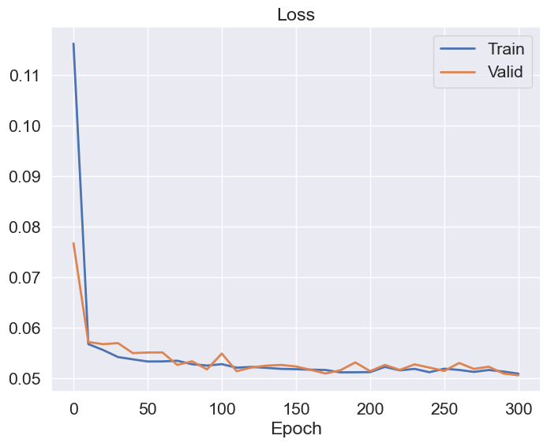
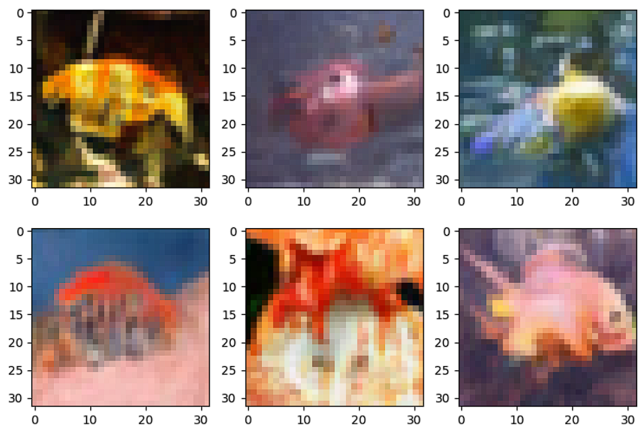
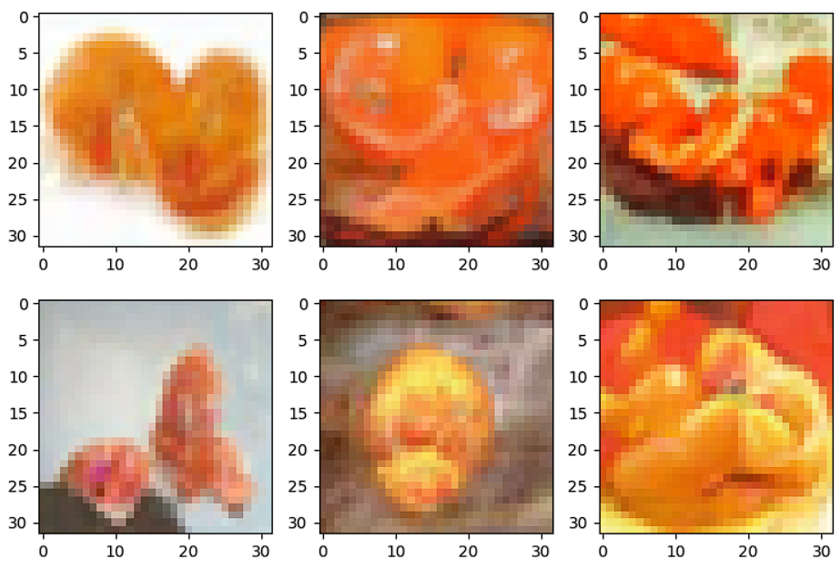
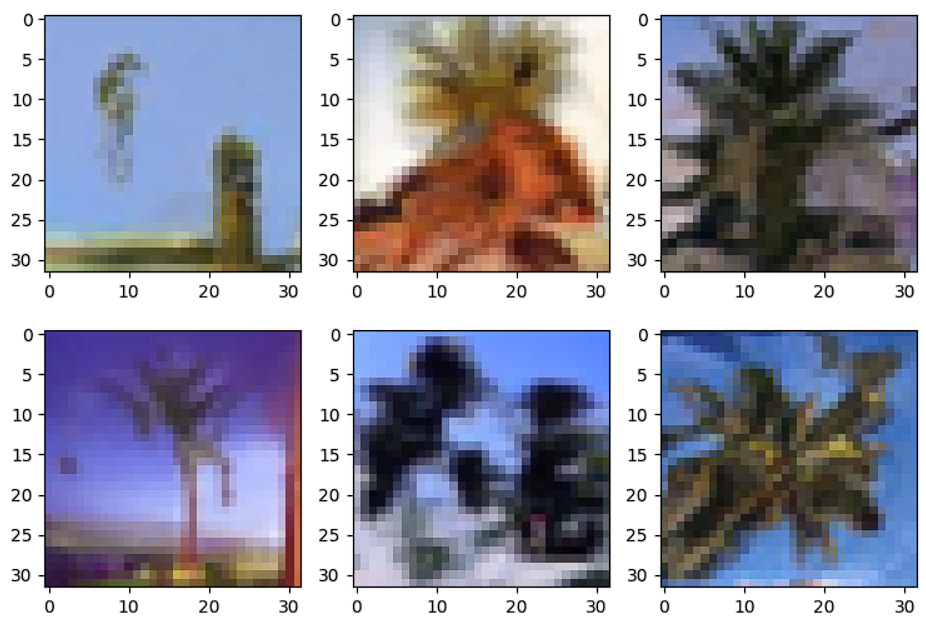
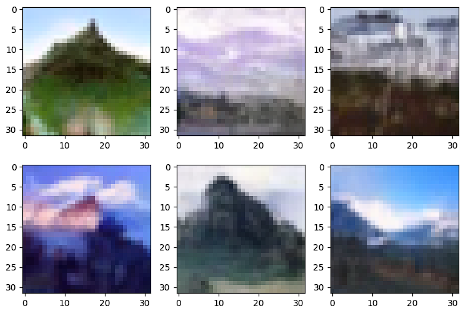

# Class conditioned DDPM
Simple class conditioned denoising diffusion probabilistic model

## Used dataset
CIFAR-100

## Used GPU
Nvidia GeForce RTX 3050 8 GB VRAM

## Hyperparameters
- batch_size = 64
- epochs = 300
- learning_rate = 3e-4
- timesteps = 1000
- beta_schedule = linear
- etc

## Number of model parameters
36.2M 

## Losses 

## Results
Some classes:
- aquarium_fish:

- orange:

- palm_tree:

- mountain:

